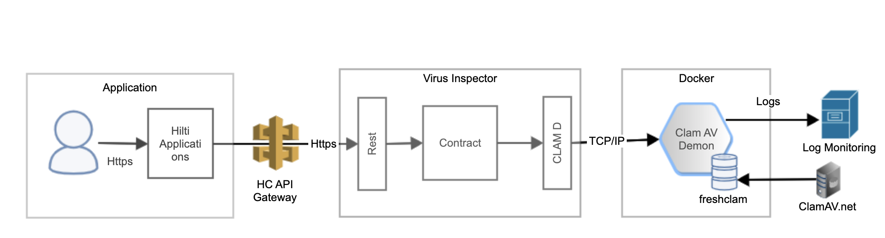

#Virus Inspector

#Motivation
"I am building an application where my user will be able to upload files, And I want to make sure there are no executable files. i.e. no virus"

If the above statement is your business need then this application can help you to achieve this.

#Build status
 todo http://www.codeblocq.com/2016/04/Setup-Travis-CI-with-your-node-project/
## High level design 


## The technical details


## Setting up clamd server

Clamd should be up and running before running the virus inspector service. 

To start Clamd pull and run [clamd Docker image](https://hub.docker.com/r/mkodockx/docker-clamav).
```
docker run -d -p 3310:3310 mk0x/docker-clamav:alpine
```

# Usage
Virus inspector can be build either using build tool like maven
steps: 
```
git clone https://github.com/anantshr/Virus-inspector.git
```
```
cd Virus-inspector
```
update application.yml file if your clamd server is running on other VM.
```
clamd:
  hostname: localhost
  port: 3310
  timeout: 50000
```
from root of your project run maven build.
```
mvn package
```
once build is success starting the REST service is quite straightforward
```
java -jar virus-inspector-0.0.1.jar 
```

# Testing the REST service```
```
curl localhost:8080
Clamd responding: true

curl --output -F "file=<file>" -X POST localhost:8080/diagnosticReport 
Everything ok : false
```
#License
ClamAV is licensed under the GNU General Public License, Version 2.
